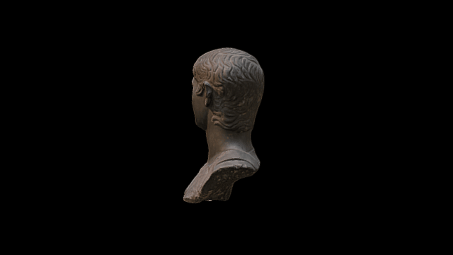

 

# A 3D model of a bust of Germanicus, British Museum

3D data for recreation of a British Museum object.

This bust shows the Roman general Germanicus (15 BC - AD 19) in military dress. Germanicus was the nephew and adopted son of Tiberius (reigned AD 14-37), the second emperor of Rome. He commanded the eight Roman legions on the Rhine frontier, apparently with some distinction, recovering two of the legionary standards lost after a military disaster in the Teutoberg forest (AD 9).

Google Cultural Institute: http://bit.ly/germanicusBM

# LICENSE
The contents of this repository are licensed under CC-BY-NC-SA

# Credits
Photographs and models by Daniel Pett <dpett@britishmuseum.org>, Digital Humanities Lead, British Museum
